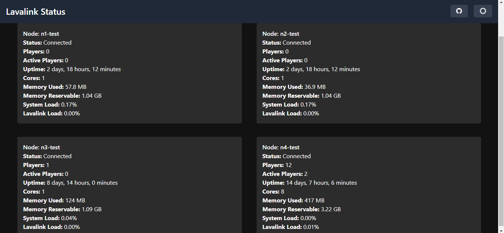

<h1 align="center">Lavalink Status</h1>

<p align="center"><strong>Note:</strong> This branch supports only Lavalink v4. Lavalink v3 no longer maintained so please update your Lavalink</p>

## Installation Guide

1. **Ensure NodeJS v18 or Later**:
    - Make sure your NodeJS version is 18 or later.

2. **Clone the Repository**:
    - Clone the repository or download the ZIP file:
    ```sh
    git clone https://github.com/LewdHuTao/Lavalink-Status.git
    ```

3. **Configure the Bot**:
    - Fill in the [config.js](https://github.com/LewdHuTao/Lavalink-Status/blob/main/src/config.js) file with your Lavalink Setting, Bot Token, and Channel ID where you want to send the status updates.

4. **Install Required Packages**:
    - Run the following command in your console:
    ```sh
    npm install
    ## or
    yarn install
    ```

5. **Start the Bot**:
    - Use one of the following commands to start the bot:
    ```sh
    npm run start
    ## or
    node .
    ```

6. **Report Issue**:
    - If you encounter any issues or the code doesn’t work, please [create an issue](https://github.com/LewdHuTao/Lavalink-Status/issues).

## Web Monitor

1. **Enable Web Monitor**:
    - Set `webMonitor` to `true` in the [config.js](https://github.com/LewdHuTao/Lavalink-Status/blob/main/src/config.js) file.

2. **Access the Web Monitor**:
    - Open your browser and navigate to `http://localhost:3000`.

3. **Custom Domain**:
    - You can use a custom domain and set it up using services like ngrok, Cloudflare Tunnel or whatever service you like that can asign custom domain.

### Web Monitor Preview



### Badge Icon

You can embed these badge icons in any .md file to show your node status or node players.

- Preview

 
<br>


- Endpoints:

1. Status Icon enpoint:

```
GET /api/v1/badge/status/:nodeIndex
```

Replace :nodeIndex with the index of the node you want to retrieve the status for.

2. Players Icon enpoint:

```
GET /api/v1/badge/players/:nodeIndex
```

Replace :nodeIndex with the index of the node you want to retrieve the status for.
